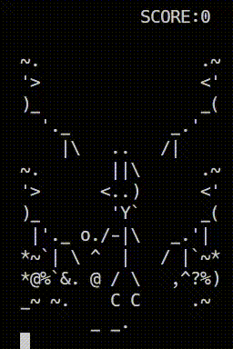

## WOLF GAME

This is a game from "Nu pogodi" console written
on C and working in command line.

You should catch the eggs by holding your basket.

### Compile

    make

or try
    gcc main.c -o main -std=c11 -O1 -Wall

### GamePlay

Movement:
to move use _LEFT, RIGHT, UP, DOWN_ keys
to choose one egg tray. If you see the egg on
another tray, switch basket to it.